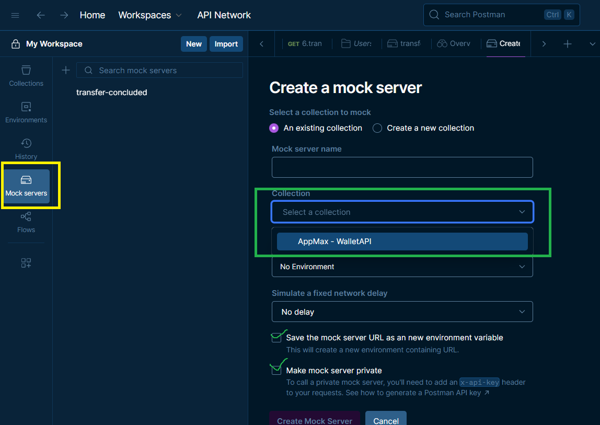
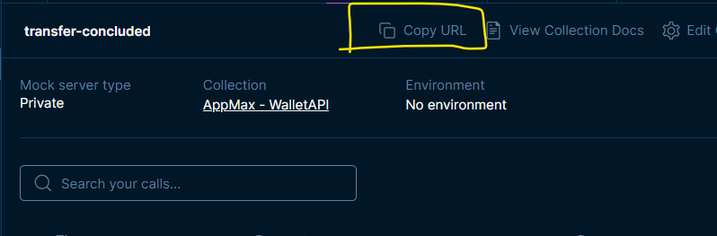

# Wallet API

Uma API RESTful desenvolvida em Laravel para gerenciamento de carteiras digitais, usuários e transações financeiras.

## Considerações iniciais
Removi o .env do .gitignore por conveniência e para facilitar os testes.

A coleção do Postman está disponível no repositório. Dessa forma, pode ser utilizada para os testes.

Para simular o webhook, foi utilizado o recurso de MockServer do próprio Postman. Para habilitá-lo, é simples:
  1. Abra o Postman e clique no ícone:
    
  2. Habilite o MockServer caso não esteja habilitado
    
  3. Crie um mockserver
    
  4. Copie a url e cole na variável de ambiente WEBHOOK_URL
    

## 🚀 Funcionalidades

- **Gerenciamento de Usuários**: Cadastro de novos usuários.
- **Autenticação**: Login, logout e refresh de token (JWT/Sanctum).
- **Carteira Digital**:
  - Criação de carteira.
  - Consulta de saldo.
  - Adição de saldo (Depósito).
  - Retirada de saldo (Saque).
  - Transferência entre carteiras.
  - Histórico de transações.

## 🛠️ Tecnologias Utilizadas

- **PHP** ^8.2
- **Laravel** (Framework)
- **SQLite** (Banco de dados)
- **JWT Auth / Sanctum** (Autenticação)

## ⚙️ Pré-requisitos

Certifique-se de ter instalado em sua máquina:

- PHP >= 8.2
- Composer

## 📦 Instalação

1. Clone o repositório:
```bash
git clone https://github.com/seu-usuario/wallet-api.git
cd wallet-api
```

2. Instale as dependências do PHP:
```bash
composer install
```

3. Configure o arquivo de ambiente:
```bash
cp .env.example .env
```
Edite o arquivo `.env` e configure os dados do seu banco de dados na seção `DB_`.

4. Gere a chave da aplicação:
```bash
php artisan key:generate
```

5. Execute as migrações para criar as tabelas no banco de dados:
```bash
php artisan migrate
```

6. Execute o seed para popular as tabelas
```bash
php artisan db:seed
```

7. Inicie o servidor de desenvolvimento e o worker para processar os jobs:
```bash
php artisan serve
php artisan queue:work
```
A API estará disponível em `http://localhost:8000`.

## 📍 Endpoints da API

### Autenticação

| Método | Endpoint | Descrição |
|---|---|---|
| POST | `/api/auth/login` | Realiza login e retorna o token de acesso. |
| POST | `/api/auth/logout` | Realiza logout (Requer autenticação). |
| POST | `/api/auth/refresh` | Atualiza o token de acesso (Requer autenticação). |

### Usuários

| Método | Endpoint | Descrição |
|---|---|---|
| POST | `/api/users` | Cria um novo usuário. |

### Carteira (Requer Autenticação)

| Método | Endpoint | Descrição |
|---|---|---|
| POST | `/api/users/wallet` | Cria uma carteira para o usuário autenticado. |
| GET | `/api/users/wallet/balance` | Consulta o saldo atual. |
| PATCH | `/api/users/wallet/balance/add` | Adiciona saldo à carteira. |
| PATCH | `/api/users/wallet/balance/withdraw` | Realiza saque da carteira. |
| POST | `/api/users/wallet/balance/transfer` | Realiza transferência para outra carteira. |
| GET | `/api/users/wallet/transactions` | Lista o histórico de transações. |

## 🧪 Testes

Para executar os testes automatizados (se disponíveis):

```bash
php artisan test
```

## 📄 Licença

Este projeto está licenciado sob a [MIT license](https://opensource.org/licenses/MIT).
